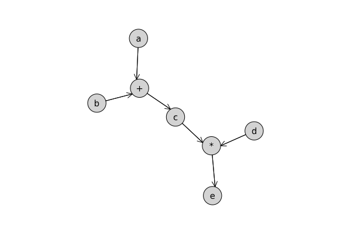
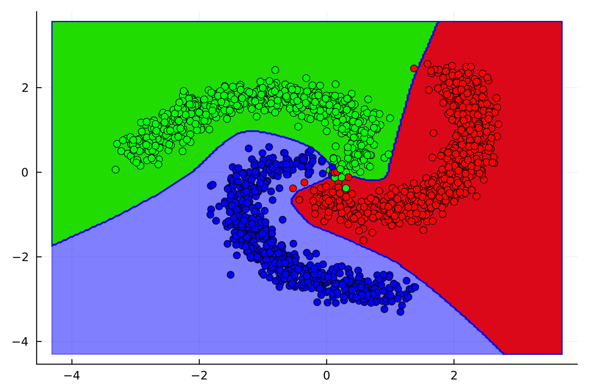

# AutoDiff.jl

[](LICENSE.txt)
[](https://github.com/B0B36JUL-FinalProjects-2023/Projekt_mychkvad/actions?query=workflow%3ACI)

`AutoDiff.jl` is a Julia package designed for automatic differentiation, enabling efficient and precise gradient computations necessary for a wide range of applications including machine learning, optimization, and numerical analysis.
Central to the package is the `Tensor` struct, which encapsulates not only the data but also the computational graph: a record of operations performed, allowing backward propagation of gradients.

## Aim
The aim of `AutoDiff.jl` is to provide a powerful yet user-friendly automatic differentiation library in Julia that supports complex numerical computations and facilitates the development of advanced optimization and machine learning algorithms.
Whether you're optimizing neural networks or implementing custom gradient-based algorithms, `AutoDiff.jl` is designed to streamline your workflow and enhance productivity.

## Features
- Dynamic Computational Graphs: Create and evaluate computational graphs dynamically, allowing for flexible model architectures and on-the-fly modifications.
- Gradient Computation: Automatically compute gradients of vector-valued functions with respect to multidimensional inputs, simplifying the implementation of gradient-based optimization algorithms.
- Custom Tensor Operations: Define custom operations on tensors, including arithmetic operations, mathematical functions, and matrix operations, all while automatically handling gradient propagation.
- Efficient Backpropagation: Utilize efficient backpropagation algorithms for gradient computation, reducing the computational overhead and improving performance for complex models.

## Installation
Package is not registered, but can be installed in the following way:
```
(@v1.10) pkg> add https://github.com/B0B36JUL-FinalProjects-2023/Projekt_mychkvad
```

## Usage
`AutoDiff.jl` is designed with simplicity and ease of use in mind.
Here's a quick start guide:
```julia
using AutoDiff

# Perform forward pass, each operation is broadcasted
a = Tensor(rand(Float32, (3, 3)); require_grad=true, label="a")
b = Tensor(rand(Float32); label="b")
c = a + b
c.label = "c"
d = Tensor(rand(Float32, 3); label="d")
e = c * d
e.label = "e"

# Perform backward pass: compute gradients
backward(e)

# Outputs the gradient of `e` with respect to `a`
println(a.grad)

# Plots computational graph
show_graph(e)
```



## Examples
Example on how to train Multilayer Perceptron using the `AutoDiff` engine can be found [here](examples/mlp_classifier.ipynb)

